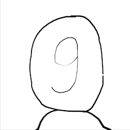
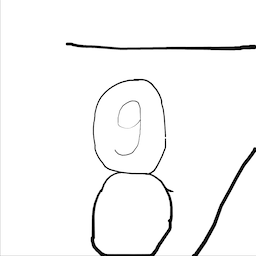

# Infinite Zoom

This toolbox contains a set of scripts and directories for interactive drawing and infinite zoom animation creation. For now, only the MATLAB version is available. 

## License

This project is licensed under the MIT License.